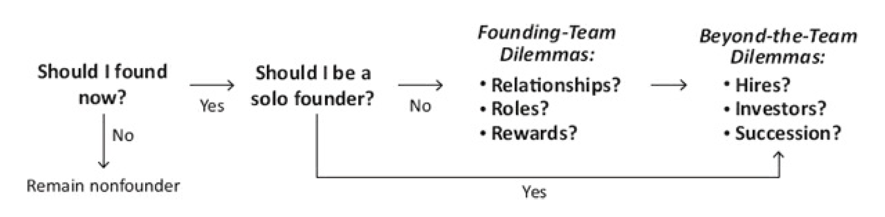
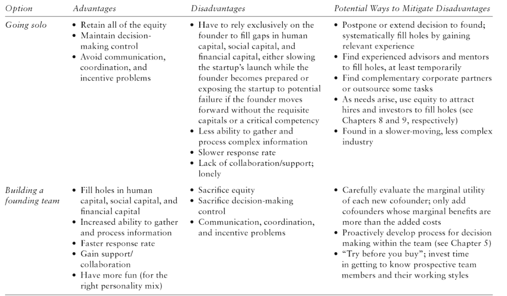
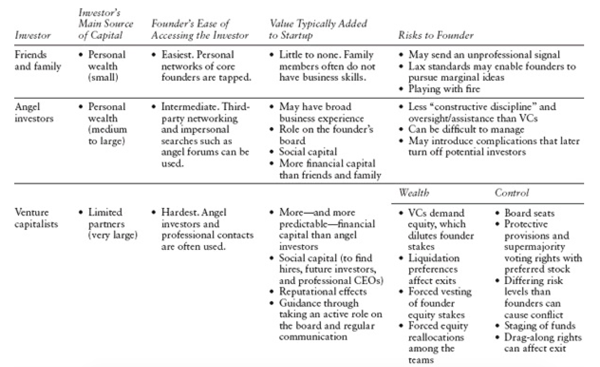

# Founding Cheat Sheet

### Table of Contents

- [Introduction](#introduction)
- [Pre-founding Dilemmas](#pre-founding-dilemmas)
- [Founding Team Dilemmas](#founding-team-dilemmas)
  - [The Solo-versus-Team Dilemma](#the-solo-versus-team-dilemma)
  - [The Three Rs](#the-three-rs)
  - [Relationship Dilemmas](#relationship-dilemmas)
  - [Role Dilemmas](#role-dilemmas)
  - [Reward Dilemmas](#reward-dilemmas)
- [Beyond the Founding Team](#beyond-the-founding-team)
  - [Hiring Dilemmas](#hiring-dilemmas)
  - [Investor Dilemmas](#investor-dilemmas)
- [Resources](#resources)

## Introduction

Founding dilemmas:

1. **Pre-founding: Career Dilemmas** - when in my career should I launch a startup? 
   - Have I accumulated the right career experiences?
   - Is the market receptive to my idea?
   - Is my personal situation favorable?
2. **Founding Team Dilemmas** - dilemmas regarding the startup's founders.
   - **The Solo-versus-Team Dilemma** - should I launch the business myself or try to attract cofounders?
   - **Relationship Dilemmas** - whom should I try to attract as cofounders: Friends? Family? Acquaintances? Strangers? Prior coworkers?
   - **Role Dilemmas** — what positions should each of us take within the startup? 
  Which decisions can we make alone, and which should we make as a team? How should we make those decisions?
   - **Reward Dilemmas** — how should we divide equity and other financial rewards among the founding team?
3. **Beyond the Founding Team**  - dilemmas regarding the hires and investors.
   - **Hiring Dilemmas**: 
      - what types of people should I hire at different stages of growth?
      - what challenges will my early hires face as the startup grows? 
      - Should I compensate early hires differently from later hires?
   - **Investor Dilemmas**:
      - what types of investors should I target at different stages of growth? 
      - What challenges will these investors introduce?
   - **Founder-CEO Succession**:
      - why and how are founders replaced as CEOs of the startups they founded? 
      - how can founders exert more control over the process? 
      - what happens to the founder and to the startup after he or she is replaced by a hired "professional CEO"?
4. **Exit Dilemmas** - which way out?
   - Acquisition
   - IPO
   - Bankruptcy

## Pre-founding Dilemmas

Top motivations for starting a company:

1. Making a difference in the world.
2. Financial gain.
3. Power and influence.
4. Autonomy.
5. Recognition.

Best time to start a company:

1. Favorable **Career** Circumstances:
   - Broad and deep work experience (managerial experience, functional background, industry knowledge, 
   working in small vs big companies, nontraditional experiences, social capital)
   - Low opportunity costs
   - Change in golden handcuffs (the social status of an impressive title or well-known employer, and golden handcuffs, 
   such as a high salary or a vesting schedule that requires one to keep working in order to earn stock awards) 
2. Favorable **Personal** Circumstances:
   - Entrepreneurial motivations
   - Supportive family situation
   - Cash cushion
   - Positive role models (most powerful influences may come from the early messages sent by the words and actions 
   of older relatives or by the culture in which a person grew up)  
3. Favorable **Market** Circumstances:
   - Big opportunity  
   - Favorable context - are many companies competing for scarce resources?
   - Customer willingness to pay - how big is the market? Is it growing?
   - Ticking clock - is the window of opportunity about to close? Ticking-clock industries include 
      - those in which products and services are quickly derived from and just as quickly outdated by technological or
      scientific advances, 
      - those with strong "network effects" - that is, the value of the product increases as more people use it
      - those with significant economies of scale.

## Founding Team Dilemmas

### The Solo-versus-Team Dilemma

Only look for cofounders when you are missing important human, social or financial capital at time of founding:

- **Human capital**: Human capital includes the explicit knowledge derived from formal education
	and the tacit skills derived from prior experience. 
- **Social capital**: Social capital refers to the benefits derived from one's place in information
	and communication networks. New startups need to reach out to recruit employees, establish
	relationships with potential partners, meet potential investors, and gain access to many other
	outside resources. The startup will benefit from cofounders' contacts and social capital.
- **Financial capital**: Financial capital refers to the money or other tangible resources that can be
	used in the founding process.  
	
Other options may include:
- Outsourcing
- Finding advisors
- Partnering with complementary companies 

Pros and cons of going solo versus building a founding team:

### The Three Rs

1. **Relationships**
   - **Friends/family** vs **acquaintances** vs **past coworkers**
   - **Homogeneous** vs **heterogeneous** teams
2. **Roles**
   - **Overlapping roles** vs **division of labor**
   - **Egalitarian** vs **hierarchical decision making**
3. **Rewards**
   - **Equal** vs **unequal equity splits**
   - **Static** vs **dynamic agreements**  

### Relationship Dilemmas

Founding team **Homogeneity** vs **Diversity**

- Tangible Factors:
   - **Human capital**: cofounders with similar human capital can communicate more easily but the team may be missing critical skills.
   - **Social capital**: mutual obligations are more enforceable but the divercity of information received by the team is reduced.
- Intangible factors:
   - **Decision-making style (hierarchical vs consensus)**: cofounders with similar styles make decisions more quickly. 
   But there is no counterbalance.
   - **Risk tolerance (risk-seeking vs risk-averse)**: cofounders with similar risk tolerances may be more stable partners.
   But there is no counterbalance.
   - **Commitment level**: cofounders with similar levels will be more likely to appreciate each other's efforts.
   But there is no counterbalance.
   - **Value system**: cofounders with similar values will be more aligned regarding their priorities and preferences.
   But there is no counterbalance. 

Strangers (no prior relationship) -\> Past co-workers (prior professional relationship) -\> Friends and Family (prior social relationship)

- the likelihood of discussing "Elephants in the room" is the lesser the closer prior relationships between cofounders.
People tend to worry that raising thorny issues between friends / family would signal distrust of that friend / relative.
If a business decision makes business sense but might damage the
social relationship, founders naturally try to avoid making the business decision in the hope that the
problem will pass.
- the risk of destroying prior relationship is the greater the closer prior relationships between cofounders.  

Founders who decide to mix business and social relationships despite these dangers should at least
take proactive steps to protect themselves and the startup:
- **Compartmentalize relationships**: If the team's size allows, avoid having cofounders report to
their relative or close friend. Instead, have the cofounder report to another senior executive,
keeping the private and professional relationships separate.
- **Envision negative scenarios**: Think about the obstacles — such as family issues, medical
crises, and legal problems — that could affect a cofounder's ability to work on the startup.
Resist the natural inclination of many founders to "stay positive", focusing on only desirable
scenarios.
- **Create a disaster plan**: Put in writing a plan of action for the worst-case scenarios, such as
an irresolvable business conflict or a breakup in the social relationship. Also, make it clear
who has the final say in an impasse. Sign an exit contract that will apply if a worst-case
scenario develops.
- **Force sensitive discussions**: Make a long-term policy of being open and honest about every
personal issue that arises in the process of working together. Increasing the likelihood of
discussing sensitive issues — by establishing a mechanism for it — can reduce the Playing-with-Fire Gap. 
Resist the natural inclination to put off or avoid
discussions of difficult issues in the hope that they will solve themselves.
- **Involve a referee**: In order to prevent a professional disagreement from getting personal,
write up a memo on the issue at hand and copy the entire executive team. 
This forces others to get involved
and puts the emphasis on the issue itself rather than on the people advancing the issue. Or, use
a mutual mentor or impartial advisor to mediate.

### Role Dilemmas

#### Role Assignment

**Overlapping roles**
  - Pros:
	  + Offers **flexibility** appropriate to early-stage startups
	  + Team members can **pitch in wherever needed**
	  + **Taps collective knowledge** of all team members
  - Cons:
      - Diffused responsibility **weaken incentives**
      - May **increase tension** as founders step on each other's toes

**Division of labor**
  - Pros:
     + Enables **assignment of titles, tasks and responsibility**
     + Provides **better accountability**
  - Cons:
     - **Hard to collaborate** on cross-cutting tasks
  
#### Decision-Making Approaches

- **Egalitarian** (or consensus) approach - the members of the team make decisions collectively by coming to a 
complete consensus, and act as peers rather than superiors and subordinates.
   - **Higher quality** of decisions
   - **Slower** decision making
- **Hierarchical** (or autocratic) approach - the team has a formal process for making decisions and a clear hierarchy, 
with a single person responsible for final decisions.
   - **Lower quality** of decisions
   - **Faster** decision making
- **Composite** - first, the team attempts to reach a full consensus. If consensus is not forthcoming, the CEO
    and relevant functional VP make their decision, but only after getting input from everybody in a public forum.
    
#### Pitfalls

- **Don't crown multiple decision makers just to avoid a confrontation**. While ducking the original conflict may seem 
to have saved the startup from an early implosion, it actually causes longer-term conflict, endangering the startup's
future.
- **Don't underestimate "Title Inertia"** - the CEO has considerable symbolic and substantive power. He has to be chosen
carefully as most CEOs are reluctant to relinquish their status and power, even when it's obvious they are not the best fit
for the role.
- **Don't inflate titles** - the dangers of inertia likewise apply to non-CEO founders who take C-level titles. 
Once the startup has grown much bigger, many of those founders will not be the best people to fill those senior positions. 
Yet, demoting or replacing "overtitled" founders can be quite disruptive.
- **Don't ignore incompatible motivations** - if two founders are strongly control-motivated, both are likely to want 
to be decision makers. This can result in conflicts. In contract, when both founders are wealth-motivated, or
one of them is control-motivated and the other is wealth-motivated, the team tend to be more stable.  
  
### Reward Dilemmas

Factors for determining equity splits:

1. **Past Contributions**: How much has the founder contributed to building the value of the startup so far?
   - **Idea Premium**: Founders who contribute the original idea on which the startup is based
	have made a unique contribution to the venture.
   - **Capital Contribution**: Founders who have made larger contributions to the startup's seed
	capital should see a proportionate increase in their equity ownership.
2. **Opportunity Cost**: What are the founders sacrificing in order to pursue the startup?
3. **Future Contributions**: Most of the work required for the startup to be successful will come
	in the future, but these contributions can be hard to anticipate. How much can each founder
	be expected to contribute to the value of the startup down the road?
   - **Serial Founders**: Members of the founding team who have previously led a startup to a
	successful exit can be expected to contribute more human and social capital down the road.
   - **Level of Commitment**: Founders who are committed full-time to the venture can be
	expected to contribute more value.
   - **Titles**: The official positions of the members of the founding team have been shown to
	influence equity splits, with CEOs receiving a substantial equity premium.
4. **Founder Motivations and Preferences**
   - **Wealth Motivations** should lead founders to prioritize larger equity stakes.
   - **Risk Aversion and Optimism** will affect how much priority a founder places on gaining
	equity versus cash compensation.
   - **Tolerance for Conflict** will affect a founder’s willingness to engage in negotiations.
   - **Prior Relationships** can affect expectations about equity splits.
   
Consider **dynamic splits** - adjust the split as circumstances change. If the contribution of one of the founder 
changes, his equity split should change accordingly.

**Vesting** is the most common type of dynamic equity agreement. 
- Vesting terms require founders to earn their equity stakes, either over a specified time or when they accomplish 
specific milestones. 
- Founders who leave a startup before their equity has fully vested must relinquish the unvested portion to the startup 
or to their cofounders.  

**The Founder Discount** - founders usually have lower salaries than non-founders with same titles, because founders
are additionally motivated by their equity share.

### Beyond the Founding Team

#### Hiring Dilemmas

Evolution of hiring decisions as the startup matures:

| Stage of Development | **Relationships** | **Roles** | **Rewards** |
| --- | --- | --- | --- |
| **Startup** | (1) **Personal networks of core founder** are tapped to find loyal candidates who fit with the culture of the startup | (1) **Generalists** who cover multiple areas. (2) **"Flat" structure** that has many C-level employees with few reports | (1) **Low cash compensation**. (2) **High equity compensation**. (3) **Low gender gap**. (4) **Less vesting** |
| **Transition** | (1) Impersonal searches (**newspaper ads, search firms**). (2) The **networks of investors** and other participants are leveraged. | (1) **"Players" transition to "Coaches"**. (2) Some early **employees are usually unable to adapt** to the changing needs of the company | (1) **Moderate cash compensation**. (2) **Lower equity compensation**. (3) **Vesting equity stakes** |
| **Mature** | (1) **Investor networks are tapped**. (2) **Executive search firms are hired** | (1) The reporting structure is **"pyramidal"**. (2) **"Professional" executives** from large-company backgrounds | (1) **High cash compensation**. (2) **Employee stock options**. (3) **The gender gap emerges** |

#### Investor Dilemmas

### SAFE (Simple Agreement for Future Equity)

[Postmoney SAFE templates](https://www.ycombinator.com/documents/)

By "post-money," we mean that safe holder ownership is measured after (post) all the safe money is accounted for - which is its own round now - but still before (pre) the new money in the priced round that converts and dilutes the safes (usually the Series A, but sometimes Series Seed). The post-money safe has what we think is a huge advantage for both founders and investors - the ability to calculate immediately and precisely how much ownership of the company has been sold. It’s critically important for founders to understand how much dilution is caused by each safe they sell, just as it is fair for investors to know how much ownership of the company they have purchased. 

[SAFE calculations example](https://docs.google.com/document/d/1xLGLoinj-FjtdmCo5P4LRn1OD49ix_BSeoDY1iuHUlE/edit)
   
## Resources

- The Founder's Dilemmas: Anticipating and Avoiding the Pitfalls That Can Sink a Startup, by Noam Wasserman 
https://www.amazon.com/Founders-Dilemmas-Anticipating-Foundation-Entrepreneurship/dp/0691158304
